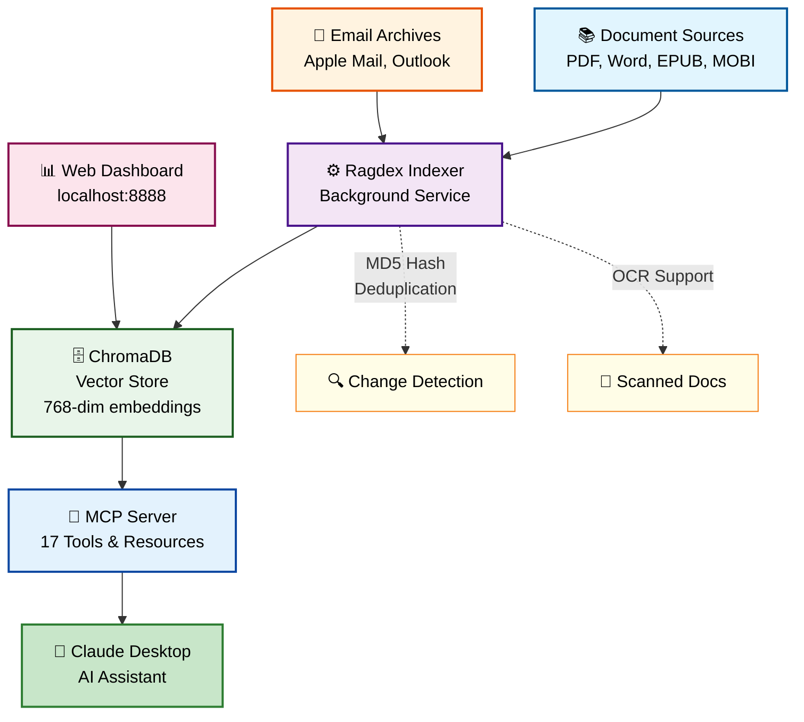

<div align="center">

# 🚀 Ragdex

### Transform Your Documents & Emails into an AI-Powered Knowledge Base

[](https://badge.fury.io/py/ragdex)
[](https://www.python.org/downloads/)
[](https://opensource.org/licenses/MIT)
[](https://modelcontextprotocol.io/)
[](https://pypi.org/project/ragdex/)

**Ragdex** is a powerful Model Context Protocol (MCP) server that transforms your personal document library and email archives into an AI-queryable knowledge base. Built for Claude Desktop and compatible with any MCP client.

[Features](#-features) • [Quick Start](#-quick-start) • [Documentation](#-documentation) • [Examples](#-examples) • [Support](#-support)

</div>

---

## ✨ Features

### 🎯 Core Capabilities

<table>
<tr>
<td width="50%">

#### 📚 Universal Document Support
- **PDFs** with OCR for scanned documents
- **Office Files** (Word, PowerPoint, Excel)
- **E-books** (EPUB, MOBI, AZW, AZW3)
- **Plain Text** and Markdown files
- **Automatic format detection**

</td>
<td width="50%">

#### 📧 Email Intelligence (v0.2.0+) 🔒
- **Apple Mail** (EMLX) support
- **Outlook** (OLM export) support
- **Smart filtering** - Skip marketing & spam
- **Attachment processing**
- **Thread reconstruction**
- **Privacy**: Disabled by default - [Enable it →](QUICKSTART.md#-optional-enable-email-indexing)

</td>
</tr>
<tr>
<td width="50%">

#### 🔍 Advanced Search & RAG
- **Semantic search** with vector embeddings
- **Cross-document insights**
- **Context-aware responses**
- **17+ specialized MCP tools**
- **Real-time index updates**

</td>
<td width="50%">

#### 🎨 Beautiful Web Dashboard
- **Real-time monitoring** at `localhost:8888`
- **Indexing progress tracking**
- **Document & email statistics**
- **Failed document management**
- **Search interface with filters**

</td>
</tr>
</table>

### 🛠️ MCP Tools Available

| Tool | Description |
|------|-------------|
| 🔍 **search** | Semantic search with optional filters |
| 📊 **compare_perspectives** | Compare viewpoints across documents |
| 📈 **library_stats** | Get comprehensive statistics |
| 📖 **summarize_book** | Generate AI summaries |
| 💭 **extract_quotes** | Find relevant quotes on topics |
| ❓ **question_answer** | Direct Q&A from your library |
| 📚 **list_books** | Browse by pattern/author/directory |
| 📅 **recent_books** | Find recently indexed content |
| 🔄 **refresh_cache** | Update search cache |
| ...and 8 more! | |

### 🎯 Smart Email Filtering

> **🔒 Privacy First**: Email indexing is **DISABLED by default**. Your emails are NOT accessed unless you explicitly enable this feature. [Learn more →](QUICKSTART.md#-optional-enable-email-indexing)

When enabled, Ragdex intelligently filters out noise from your email archives:

- ❌ **Auto-skips**: Marketing, promotions, shopping receipts, newsletters
- ❌ **Excludes**: Spam, junk, trash folders
- ✅ **Focuses on**: Personal communications, important discussions
- ⚙️ **Configurable**: Whitelist important senders, set date ranges
- 🔐 **Local processing**: All email data stays on your computer

---

## 🚀 Quick Start

> **🆕 New to Ragdex? First time user?**
> See **[QUICKSTART.md](QUICKSTART.md)** for detailed step-by-step instructions including prerequisites, troubleshooting, and first query examples.

### Prerequisites

**Quick Checklist** (see [Complete Prerequisites Guide →](QUICKSTART.md#-before-you-begin---complete-checklist)):

- **System**: macOS 10.15+ or Linux (Ubuntu 20.04+, Debian 11+, Fedora 35+)
- **Python**: 3.10-3.12 (NOT 3.13) - [How to check →](QUICKSTART.md#1-python-310-311-or-312)
- **macOS Tools**: Xcode Command Line Tools - [How to install →](QUICKSTART.md#2-xcode-command-line-tools-macos-only)
- **macOS Tools**: Homebrew - [How to install →](QUICKSTART.md#3-homebrew-macos-package-manager)
- **Package Manager**: uv (recommended) - [How to install →](QUICKSTART.md#4-uv-fast-python-package-manager)
- **Claude Desktop**: Free or paid tier - [Download →](https://claude.ai/download)
- **Permissions (macOS)**: Terminal Full Disk Access - [Critical setup →](QUICKSTART.md#2-full-disk-access-macos-only---critical)
- **Resources**: 8GB RAM min (16GB recommended), 5GB disk space
- **Admin Access**: Required for installation - [Details →](QUICKSTART.md#1-adminsudo-access)

**Optional Tools** (format-specific):
- Calibre (MOBI/AZW ebooks), LibreOffice (.doc files), ocrmypdf (scanned PDFs)
- [See all optional dependencies →](QUICKSTART.md#-optional-dependencies-format-specific)

**Run Prerequisites Check Script**: [Verification script →](QUICKSTART.md#-prerequisites-verification-script)

### Installation (2-5 minutes)

> **⚡ Use uv for best experience** - 10-100x faster than pip, better dependency resolution, avoids common errors

```bash
# Using uv (⭐ STRONGLY RECOMMENDED)
uv venv ~/ragdex_env
uv pip install --python ~/ragdex_env/bin/python ragdex

# Alternative: pip (slower, requires activation)
python3 -m venv ~/ragdex_env
source ~/ragdex_env/bin/activate
pip install ragdex
```

**Note**: First run downloads ~2GB of AI models (5-10 min). [Details](QUICKSTART.md#-first-run-model-download)

**Don't have uv?** Install it: `curl -LsSf https://astral.sh/uv/install.sh | sh` (then close/reopen Terminal)

#### 🐳 Docker Installation (Alternative)

Want to run Ragdex in containers? Perfect for:
- Clean isolated environment
- Easy deployment and updates
- Cross-platform consistency

```bash
# Quick start with Docker
docker-compose up -d

# Access web dashboard
open http://localhost:8888
```

**[→ Complete Docker setup guide](DOCKER.md)** - Includes external Vector DB, Document Library, and log configuration.

### Setup Services (2-3 minutes)

```bash
# Download and run interactive installer
curl -O https://raw.githubusercontent.com/hpoliset/ragdex/main/install_ragdex_services.sh
chmod +x install_ragdex_services.sh
./install_ragdex_services.sh
```

The installer will:
- Ask where your documents are located
- Set up background indexing
- Configure the web dashboard (localhost:8888)
- Display a JSON configuration for Claude Desktop

### Configure Claude Desktop

1. **Copy the JSON configuration** displayed by the installer
2. **Open Claude's config**: `~/Library/Application Support/Claude/claude_desktop_config.json`
3. **Paste the configuration** (merge if you have other MCP servers)
4. **Restart Claude Desktop** (Cmd+Q, then reopen)

**[→ Detailed configuration guide with examples](QUICKSTART.md#-configuration-5-minutes)**

### Verify Installation

```bash
# Check version
~/ragdex_env/bin/ragdex --version

# Check services running
launchctl list | grep ragdex

# View web dashboard
open http://localhost:8888

# Test in Claude Desktop
# Ask: "Can you check my library stats?"
```

**[→ Complete verification steps](QUICKSTART.md#-verification-test-your-installation)**

### Troubleshooting

Having issues? Common problems and solutions:
- **Wrong Python version?** [Install Python 3.11](QUICKSTART.md#-step-1-check-your-python-version)
- **Claude doesn't see Ragdex?** [Check your config](QUICKSTART.md#problem-3-claude-desktop-doesnt-show-ragdex-tool)
- **No documents indexed?** [Verify paths and permissions](QUICKSTART.md#problem-4-no-documents-found-or-0-documents-indexed)

**[→ Full troubleshooting guide](QUICKSTART.md#-troubleshooting)**

**You're done!** 🎉 Start querying your documents with Claude.

---

## 📖 Documentation

### System Requirements

- **Python 3.10-3.12** (3.13 not supported due to dependency conflicts)
- **macOS** (primary) or **Linux** (Windows not yet supported)
- **8GB RAM minimum** (16GB recommended)
  - Embedding model uses ~4GB
  - Document processing can spike to 6-8GB for large PDFs
- **Storage**:
  - ~500MB for Ragdex installation
  - ~2GB for embedding models (auto-downloaded on first run)
  - ~1MB per 100-page PDF for vector database storage
- **Claude Desktop** (required for MCP integration)
- **Optional dependencies**:
  - Calibre (for MOBI/AZW ebooks)
  - LibreOffice (for .doc files)
  - ocrmypdf (for scanned PDFs)

### Configuration Options

#### Environment Variables

```bash
# Core paths
export PERSONAL_LIBRARY_DOC_PATH="/path/to/documents"
export PERSONAL_LIBRARY_DB_PATH="/path/to/database"
export PERSONAL_LIBRARY_LOGS_PATH="/path/to/logs"

# Email settings (v0.2.0+)
export PERSONAL_LIBRARY_INDEX_EMAILS=true
export PERSONAL_LIBRARY_EMAIL_SOURCES=apple_mail,outlook_local
export PERSONAL_LIBRARY_EMAIL_MAX_AGE_DAYS=365
export PERSONAL_LIBRARY_EMAIL_EXCLUDED_FOLDERS=Spam,Junk,Trash
```

### Claude Desktop Configuration Example

<details>
<summary>📝 Complete Configuration Example</summary>

If this is your first MCP server, your `claude_desktop_config.json` should look like:

```json
{
  "mcpServers": {
    "ragdex": {
      "command": "/Users/yourname/ragdex_env/bin/ragdex-mcp",
      "env": {
        "PYTHONUNBUFFERED": "1",
        "CHROMA_TELEMETRY": "false",
        "PERSONAL_LIBRARY_DOC_PATH": "/Users/yourname/Documents",
        "PERSONAL_LIBRARY_DB_PATH": "/Users/yourname/.ragdex/chroma_db",
        "PERSONAL_LIBRARY_LOGS_PATH": "/Users/yourname/.ragdex/logs"
      }
    }
  }
}
```

If you already have other MCP servers, add ragdex to the existing structure:

```json
{
  "mcpServers": {
    "existing-server": { ... },
    "ragdex": {
      "command": "/Users/yourname/ragdex_env/bin/ragdex-mcp",
      "env": { ... }
    }
  }
}
```

</details>

### Advanced Installation

<details>
<summary>📦 Install with Optional Dependencies</summary>

```bash
# Document processing extras (using uv - recommended)
uv pip install ragdex[document-processing]

# Service management
uv pip install ragdex[services]

# Everything
uv pip install ragdex[document-processing,services]

# Alternative: standard pip
# pip install ragdex[document-processing,services]
```

</details>

<details>
<summary>🔧 Install from Source</summary>

```bash
git clone https://github.com/hpoliset/ragdex
cd ragdex

# Using uv (recommended)
uv pip install -e .

# With extras
uv pip install -e ".[document-processing,services]"

# Alternative: standard pip
# pip install -e ".[document-processing,services]"
```

</details>

<details>
<summary>📋 Available CLI Commands</summary>

```bash
# Main commands
ragdex-mcp            # Start MCP server
ragdex-index          # Start background indexer
ragdex-web            # Launch web dashboard

# Management commands
ragdex --help                        # Show all commands
ragdex ensure-dirs                   # Create directories
ragdex config                        # View configuration
ragdex index-status                  # Check indexing status
ragdex find-unindexed                # Find new documents
ragdex manage-failed                 # Handle failed documents
```

</details>

---

## 🔄 Upgrading Ragdex

### Upgrading from PyPI

```bash
# Stop all services first (use bootout for macOS 11+)
launchctl bootout gui/$(id -u) ~/Library/LaunchAgents/com.ragdex.* 2>/dev/null || \
launchctl unload ~/Library/LaunchAgents/com.ragdex.* 2>/dev/null

# Kill any running processes
pkill -f ragdex 2>/dev/null || true

# Using uv (recommended, faster)
uv pip install --upgrade ragdex

# Or with extras
uv pip install --upgrade ragdex[document-processing,services]

# Alternative: standard pip
# pip install --upgrade ragdex

# Restart services (use bootstrap for macOS 11+)
launchctl bootstrap gui/$(id -u) ~/Library/LaunchAgents/com.ragdex.* 2>/dev/null || \
launchctl load ~/Library/LaunchAgents/com.ragdex.* 2>/dev/null

# Restart Claude Desktop to reload MCP server
```

### Upgrading from Source

```bash
# Stop services (use bootout for macOS 11+)
launchctl bootout gui/$(id -u) ~/Library/LaunchAgents/com.ragdex.* 2>/dev/null || \
launchctl unload ~/Library/LaunchAgents/com.ragdex.* 2>/dev/null

# Kill any running processes
pkill -f ragdex 2>/dev/null || true

# Pull latest changes
cd ragdex
git pull origin main

# Upgrade dependencies (using uv for speed)
uv pip install --upgrade -e .

# Or with standard pip
# pip install --upgrade -e .

# Restart services
launchctl load ~/Library/LaunchAgents/com.ragdex.* 2>/dev/null
```

### Service Management During Upgrades

<details>
<summary>⚙️ Complete Service Restart Process</summary>

#### 1. Stop All Services
```bash
# Stop background indexer
launchctl unload ~/Library/LaunchAgents/com.ragdex.index-monitor.plist

# Stop web dashboard
launchctl unload ~/Library/LaunchAgents/com.ragdex.webmonitor.plist

# Or use the uninstall script (doesn't delete configs)
./scripts/uninstall_service.sh
./scripts/uninstall_webmonitor_service.sh
```

#### 2. Perform Upgrade
```bash
# Upgrade via uv (recommended) or pip
uv pip install --upgrade ragdex
# Or: pip install --upgrade ragdex
```

#### 3. Clear Cache & Locks (Optional)
```bash
# Clear any stale locks
rm -f ~/ragdex/chroma_db/*.lock

# Clear failed documents list if needed
ragdex clear-failed

# Refresh the search cache
ragdex refresh-cache
```

#### 4. Restart Services
```bash
# Reinstall services (updates paths if needed)
./scripts/install_service.sh
./scripts/install_webmonitor_service.sh

# Or manually load
launchctl load ~/Library/LaunchAgents/com.ragdex.index-monitor.plist
launchctl load ~/Library/LaunchAgents/com.ragdex.webmonitor.plist

# Verify services are running
launchctl list | grep ragdex
```

#### 5. Restart Claude Desktop
- **Important**: Claude Desktop must be fully quit and restarted to reload the MCP server
- On macOS: Cmd+Q to quit, then reopen Claude Desktop
- The MCP server will automatically reinitialize with the upgraded version

</details>

### Post-Upgrade Verification

```bash
# Check version
ragdex --version

# Verify services are running
ragdex index-status

# Check web dashboard
open http://localhost:8888

# Test MCP connection in Claude
# Ask Claude: "Can you check my library stats?"
```

### Troubleshooting Upgrades

<details>
<summary>🔧 Common Upgrade Issues</summary>

**Services not starting after upgrade?**
```bash
# Check service logs
tail -f ~/Library/Logs/ragdex_*.log

# Reinstall services with fresh configs
./install_ragdex_services.sh
```

**"Unload failed: 5: Input/output error" on macOS?**
```bash
# Use bootout/bootstrap for macOS 11+
launchctl bootout gui/$(id -u) ~/Library/LaunchAgents/com.ragdex.* 2>/dev/null
launchctl bootstrap gui/$(id -u) ~/Library/LaunchAgents/com.ragdex.* 2>/dev/null

# Alternative: Kill processes directly
pkill -f ragdex
```

**Claude not recognizing new features?**
- Fully quit Claude Desktop (Cmd+Q on macOS)
- Wait 5 seconds
- Reopen Claude Desktop
- The MCP server will reinitialize

**Database compatibility issues?**
```bash
# Backup existing database
cp -r ~/.ragdex/chroma_db ~/.ragdex/chroma_db.backup

# Clear and rebuild index (last resort)
rm -rf ~/.ragdex/chroma_db
ragdex-index --full-reindex
```

**Permission errors after upgrade?**
```bash
# Ensure directories have correct permissions
chmod -R 755 ~/.ragdex
ragdex ensure-dirs
```

</details>

---

## 💡 Examples

### Using with Claude Desktop

Once configured, you can ask Claude:

```
"Search my library for information about machine learning"
"Compare perspectives on climate change across my documents"
"Summarize the main themes in my recent emails"
"Find all documents mentioning Python programming"
"What meetings did I have last month?" (from emails)
```

### Python API Usage (Advanced)

While Ragdex is primarily designed for Claude Desktop via MCP, you can also use it programmatically:

```python
from personal_doc_library.core.shared_rag import RAGSystem

# Initialize the system
rag = RAGSystem()

# Search documents
results = rag.search_documents("artificial intelligence", max_results=5)

# Get document stats
stats = rag.get_library_statistics()
print(f"Documents indexed: {len(rag.book_index)}")
```

**Note**: The primary use case is through Claude Desktop. Direct API usage requires understanding the internal architecture.

---

## 🎯 Use Cases

### 📚 Personal Knowledge Management
- Build a searchable archive of your books, papers, and notes
- Never lose track of important information
- Connect ideas across different sources

### 💼 Professional Research
- Analyze technical documentation
- Compare different approaches from papers
- Extract key insights from reports

### 📧 Email Intelligence (Optional)
- Search through years of communications
- Find important attachments
- Track project discussions
- **Note**: [Must be enabled manually](QUICKSTART.md#-optional-enable-email-indexing) - disabled by default for privacy

### 🎓 Academic Study
- Research across textbooks and papers
- Extract quotes for citations
- Compare author perspectives

---

## 🏗️ Architecture


```mermaid
graph TD
    A[📚 Document Sources<br/>PDF, Word, EPUB, MOBI] --> B[⚙️ Ragdex Indexer<br/>Background Service]
    B --> C[🗄️ ChromaDB<br/>Vector Store<br/>768-dim embeddings]
    C --> D[🔌 MCP Server<br/>17 Tools & Resources]
    D --> E[🤖 Claude Desktop<br/>AI Assistant]

    F[📧 Email Archives<br/>Apple Mail, Outlook] --> B
    G[📊 Web Dashboard<br/>localhost:8888] --> C

    B -.->|MD5 Hash<br/>Deduplication| H[🔍 Change Detection]
    B -.->|OCR Support| I[📄 Scanned Docs]

    style A fill:#e1f5fe,stroke:#01579b,stroke-width:2px,color:#000
    style E fill:#c8e6c9,stroke:#2e7d32,stroke-width:2px,color:#000
    style F fill:#fff3e0,stroke:#e65100,stroke-width:2px,color:#000
    style G fill:#fce4ec,stroke:#880e4f,stroke-width:2px,color:#000
    style B fill:#f3e5f5,stroke:#4a148c,stroke-width:2px,color:#000
    style C fill:#e8f5e9,stroke:#1b5e20,stroke-width:2px,color:#000
    style D fill:#e3f2fd,stroke:#0d47a1,stroke-width:2px,color:#000
    style H fill:#fffde7,stroke:#f57f17,stroke-width:1px,color:#000
    style I fill:#fffde7,stroke:#f57f17,stroke-width:1px,color:#000
```

> 📖 **[View Detailed Architecture Documentation →](docs/ARCHITECTURE.md)**

### Components

- **⚙️ Indexer**: Background service monitoring document changes with automatic retry
- **🗄️ Vector Store**: ChromaDB with 768-dim embeddings (all-mpnet-base-v2)
- **🔌 MCP Server**: 17 tools, 5 prompts, 4 resources for document interaction
- **📊 Web Monitor**: Real-time dashboard at localhost:8888 with search interface

---

## 🤝 Contributing

We welcome contributions! Please see our [Contributing Guide](CONTRIBUTING.md) for details.

### Development Setup

```bash
# Clone and install in dev mode
git clone https://github.com/hpoliset/ragdex
cd ragdex

# Using uv (recommended)
uv pip install -e ".[dev]"

# Alternative: standard pip
# pip install -e ".[dev]"

# Run tests
pytest tests/

# Format code
black src/
```

---

## 📊 Stats & Performance

- **Indexing Speed**:
  - ~10-20 documents/minute (varies by size and format)
  - Large PDFs (>100MB): 2-5 minutes each
  - OCR processing: 1-2 pages/minute
- **Search Latency**:
  - First search: 2-5 seconds (model loading)
  - Subsequent searches: 100-500ms
- **Memory Usage**:
  - Idle: ~500MB
  - Active indexing: 4-8GB
  - With embeddings loaded: 4-6GB constant
- **Storage**:
  - Vector DB: ~10MB per 1000 pages
  - Metadata index: ~1MB per 100 documents

---

## 🐛 Troubleshooting

<details>
<summary>📝 Common Issues</summary>

**Services not starting?**
```bash
# Check service status
launchctl list | grep ragdex

# View logs
tail -f ~/ragdex/logs/ragdex_*.log
```

**Documents not indexing?**
```bash
# Check for failed documents
ragdex manage-failed

# Verify paths
ragdex config
```

**Permission errors?**
```bash
# Ensure directories exist
ragdex ensure-dirs

# Check permissions
ls -la ~/Documents/Library
```

</details>

---

## 📜 License

MIT License - see [LICENSE](LICENSE) for details.

---

## 🙏 Acknowledgments

Built with:
- [LangChain](https://langchain.com/) - LLM framework
- [ChromaDB](https://www.trychroma.com/) - Vector database
- [Sentence Transformers](https://sbert.net/) - Embeddings
- [Model Context Protocol](https://modelcontextprotocol.io/) - MCP specification

---

## 📞 Support

- 📧 **Issues**: [GitHub Issues](https://github.com/hpoliset/ragdex/issues)
- 💬 **Discussions**: [GitHub Discussions](https://github.com/hpoliset/ragdex/discussions)
- 📖 **Wiki**: [Documentation Wiki](https://github.com/hpoliset/ragdex/wiki)

---

<div align="center">
Made with ❤️ for the AI community

**[⭐ Star us on GitHub](https://github.com/hpoliset/ragdex)**
</div>